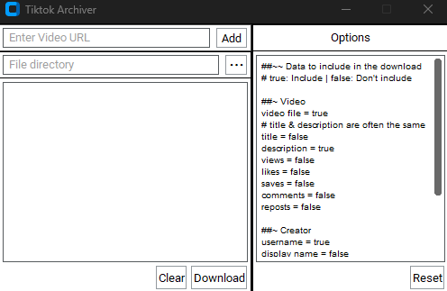

# TikTok Archiver
### A simple way to download Tiktok content and their metadata. Nothing lasts forever, but you can prolong its lifespan.

Save TikTok videos onto your device without the trouble of an ad per download or a monthly subscription.



## Disclaimer

This tool is intended for archiving **your own** content only.

It is not intended for downloading, redistributing, or repurposing content created by others. Downloading third-party content may violate TikTok's Terms of Service and copyright protection laws. You are responsible for how you use this tool.

The author accepts no liability for misuse.

## Installation

```bash
git clone https://github.com/YOURNAME/tiktok-archiver.git
cd tiktok-archiver
pip install -r requirements.txt
python main.py
```

## Batch-downloading

The URL entry supports pasting, and the program downloads per URL. Paste as many content URLs as you'd like, with support for `/video` and `/photo` content links. Downloading has URL validation and per-line error handling to help diagnose invalid URLs.

Downloading also uses a shortcut organization system: raw videos and metadata are stored in a folder, and a shortcut is created targeting the actual content.

## Config

Choose whatever you'd like to store from the available metadata.

## Extracting Data

TikTok Archiver uses yt-dlp's Python API to download content, while also using `requests` to retrieve further metadata from the creator profile and the content's soundtrack.

## Persistence

Tiktok Archiver will store your session in a save.json on close, allowing you to pick back up on where you left off, and also allowing you to retain your config. The tool creates a save.json on startup in its directory if it doesn't exist.

## Buildling

This project was built using Python 3.14.5, using CustomTkinter for the GUI.

## License

MIT — see [LICENSE](LICENSE).